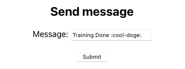

# AWS Starter Kit Training <!-- omit in toc -->

[](https://www.terraform.io/docs/index.html)
[](https://pre-commit.com/)
[](https://aws.amazon.com)
[](https://github.com/netguru/terraform-modules)

Welcome to AWS Starter Kit training grounds. Let's get started! :rocket:

<!-- vscode: ext install yzhang.markdown-all-in-one -->
- [Overview](#overview)
- [Requirements](#requirements)
- [Task 0: Local Setup](#task-0-local-setup)
- [Task 1: Project Base Setup](#task-1-project-base-setup)
  - [Storing Remote State Reliably](#storing-remote-state-reliably)
  - [Configuring DNS Zone in Route 53](#configuring-dns-zone-in-route-53)
- [Task 2: Website Hosting Setup](#task-2-website-hosting-setup)
  - [Preparing Frontend Bucket in S3](#preparing-frontend-bucket-in-s3)
  - [Configuring TLS Certificate in ACM](#configuring-tls-certificate-in-acm)
  - [Configuring CloudFront CDN](#configuring-cloudfront-cdn)
  - [Exposing Frontend in Route 53](#exposing-frontend-in-route-53)
- [Task 3: Backend Setup](#task-3-backend-setup)
  - [Preparing Backend Cluster in ECS](#preparing-backend-cluster-in-ecs)
  - [Configuring Backend Service in ECS](#configuring-backend-service-in-ecs)
  - [Exposing Backend in Route 53](#exposing-backend-in-route-53)
- [Task 4: Circle CI Setup](#task-4-circle-ci-setup)
- [Task 5: Deployment Teardown](#task-5-deployment-teardown)
- [Feedback](#feedback)

---

## Overview

Goal of this training is to create infrastructure that will host a simple 2-tier application. Project consists of:
- **Presentation layer.** Simple React application, hosted on S3 with CloudFront distribution. Access is secured by Basic Auth with Lambda@Edge.
- **Application layer.** Simple Ruby API built with [Sinatra](http://sinatrarb.com) for sending a Slack notification with message taken from React app. Backend part runs on ECS.
- **Deployment pipeline.** We are going to configure CI/CD using Circle CI.

For a more detailed infrastructure view, check out [infrastructure docs](infrastructure/README.md).

In case of any problems, reach us on Slack: `#aws-starter-kit`

---

## Requirements
- Terraform basics - [starting guide](https://learn.hashicorp.com/collections/terraform/aws-get-started)
- Terraform ≥ v1.0.0 + version manager like [tfenv](https://github.com/tfutils/tfenv) or [asdf](https://github.com/Banno/asdf-hashicorp)
- Configured AWS profile, via aws-cli/aws-vault - [How to use AWS Vault?](https://netguru.atlassian.net/wiki/spaces/DEVOPS/pages/2036760634/How+to+use+AWS+as+a+user#How-to-use-AWS-Vault%3F)
- Ability to assume `netguru-admins`/`netguru-devs`/individual role in training AWS account

```
brew install awscli tfenv
brew install --cask aws-vault
```

---

## Task 0: Local Setup

Create new repository under `{initials}-aws-starter-kit-training`
using this repository as template. If the name is already taken, adjust
the name and use it as project name in later steps.

Clone your repository locally and navigate to `infrastructure/`.

Copy `terraform.tfvars.example` as `terraform.tfvars`.

Select correct Terraform version.

    tfenv install   # reads from .terraform-version
    tfenv use       #

Make sure Terraform reports as above.

    terraform version

Start a fresh shell with AWS environment active, using a [configured](#requirements) `AWS_PROFILE_NAME`.
This is required for all Terraform operations within the context of an AWS account.

    aws-vault exec AWS_PROFILE_NAME     # netguru-cloudsandboxNN etc.
    # starts a new shell with `AWS_*` env. variables injected

    # you can debug the environment if needed too
    env | grep AWS_

> After some time, your access token will expire.
> Just start another shell with `aws-vault exec`.

Verify your access to AWS with the following command.

    aws sts get-caller-identity

> Double check the `Account` field before proceeding.

---

## Task 1: Project Base Setup

<details><summary>AWS components used in this task</summary>

- **CloudFormation** for atomic deploy of Terraform remote backend. [docs](https://docs.aws.amazon.com/AWSCloudFormation/latest/UserGuide/Welcome.html)
  - **S3** for storing Terraform remote state reliably. [docs](https://docs.aws.amazon.com/AmazonS3/latest/userguide/Welcome.html)
  - **DynamoDB** for locking Terraform state to prevent concurrent access. [docs](https://docs.aws.amazon.com/amazondynamodb/latest/APIReference/Welcome.html)
- **Route 53** for DNS zone hosting. [docs](https://docs.aws.amazon.com/Route53/latest/DeveloperGuide/Welcome.html)

</details>

### Storing Remote State Reliably

By default, Terraform handles deployed vs. [infrastructure as code (IaC)](https://en.wikipedia.org/wiki/Infrastructure_as_code) state in a local working directory.
This is not very practical when collaborating in a team because of possible race conditions, possible storage failures, as well as auditing purposes.

This is why Terraform provides so called `backends` to store state remotely,
and implements a locking mechanism over the state files to prevent concurrent infrastructure deployments.
Read more on remote state in [Terraform docs](https://www.terraform.io/docs/language/state/remote.html).

While in `infrastructure/` directory, have a look at the available commands.

    make

Prepare Terraform state bucket & locking table.

    make tfstate-create

> A new `.project-uuid` file will be created for use in resource names to reduce possible naming collision, and a CloudFormation stack for state resources will be deployed afterwards.
> This is deliberately handled outside of Terraform to alleviate the chicken-and-egg problem of state handling.

In `10_terraform.tf`, update the names of state bucket & locking table,
using value from `.project-uuid` or output of the previous command.

> Above change should be committed back into the repository.

Initialize remote state in Terraform. This validates access to state bucket/locks.

    make staging

> This will initialize local Terraform working directory and switch to specified environment.
> Terraform state can be isolated between application environments with Terraform workspaces.

Verify that you start with an empty remote state (no output means good to go).

    terraform state list


### Configuring DNS Zone in Route 53

In `terraform.tfvars`, adjust project name to `{initials}-project`.
This variable is used in various resource names, like ECS cluster names, Route 53 DNS zone names etc.

> **IMPORTANT:** Make sure that project name is unique
or there could be some conflicts in resource names.
In case of collision, the remote state will be non-empty
or S3 bucket creation will fail etc. - please adjust the name
and start over.

In `10_route53-zone.tf`, there is a resource that creates the project DNS zone.

By default, the DNS servers assigned with a zone will change whenever the zone is recreated.
It is possible to prevent this behavior by providing a [reusable DNS delegation set](https://docs.aws.amazon.com/Route53/latest/DeveloperGuide/route-53-concepts.html#route-53-concepts-reusable-delegation-set) managed outside of Terraform.

Configure `zone_delegation_id` in `terraform.tfvars` to fix the name servers.

<details><summary>How to find reusable delegation set ID?</summary>

You may list pre-existing reusable delegation sets with the following command.

    $ aws route53 list-reusable-delegation-sets
    {
        "DelegationSets": [
            {
                "Id": "/delegationset/N072596839NEPYCHH2E34",
                "CallerReference": "Fri May 21 13:37:24 CEST 2021",
                "NameServers": [
                    "ns-352.awsdns-44.com",
                    "ns-1467.awsdns-55.org",
                    "ns-1614.awsdns-09.co.uk",
                    "ns-858.awsdns-43.net"
                ]
            } # => zone_delegation_id = "N072596839NEPYCHH2E34"
        ],
        "IsTruncated": false,
        "MaxItems": "100"
    }

Create one otherwise.

    $ aws route53 create-reusable-delegation-set --caller-reference "$(date)"

</details>

However, the original domain still needs to delegate DNS management to AWS.
At this point, you would need to configure `NS` records for `PROJECT.domain.tld` at the domain provider.

> For the purposes of training, delegation records are already configured
> for `cloudsandboxNN.devguru.co` domain names in [dnsguru](https://github.com/netguru/dnsguru) repository.

In `terraform.tfvars`, set `zone_name` to `cloudsandboxNN.devguru.co`, adjusting accordingly.

Deploy project DNS zone from Terraform.

    terraform apply -target aws_route53_zone.project_zone

Verify that hosted zone exists in [Route 53](https://console.aws.amazon.com/route53/v2/hostedzones#) service.

---

## Task 2: Website Hosting Setup

<details><summary>AWS components used in this task</summary>

- **S3** for storing frontend files. [docs](https://docs.aws.amazon.com/AmazonS3/latest/userguide/Welcome.html)
- **ACM** for automatic CDN certificate renewal. [docs](https://docs.aws.amazon.com/acm/latest/userguide/acm-overview.html)
- **CloudFront** for serving frontend files with CDN. [docs](https://docs.aws.amazon.com/AmazonCloudFront/latest/DeveloperGuide/Introduction.html)
- **Route 53** for exposing CDN under project subdomain. [docs](https://docs.aws.amazon.com/Route53/latest/DeveloperGuide/Welcome.html)

</details>

### Preparing Frontend Bucket in S3

At first, you need to create an S3 bucket to store frontend files.

In `20_s3.tf`, there is a basic bucket configuration present.
However, the bucket in default configuration is restricted from
any public access. Thus, CDN will not be able to read frontend files.
This can be fixed by creating an Origin Access Identity.

Navigate to [Terraform modules docs](https://github.com/netguru/terraform-modules)
and check how to enable OAI setting in S3 buckets.

Afterwards, create the bucket with:
```
terraform apply -target module.s3
```

Test by navigating to the URL from:
```
s3_bucket_bucket_regional_domain_name
```

You will get a 403 Denied error because of public access block.

### Configuring TLS Certificate in ACM

In `20_acm-cloudfront.tf`, using provided hints, configure ACM to generate a TLS certificate for CloudFront.

Create ACM with:
```
terraform apply -target module.acm-cloudfront
```

Verify that certificate is `Issued` in ACM with AWS Console.
Log in to your training account and pick N. Virginia region,
then search for ACM.

### Configuring CloudFront CDN

In `terraform.tfvars`, make sure to set your Basic Auth credentials.

In `20_cloudfront-s3.tf`, there is an incomplete CloudFront CDN configuration.
Follow the hints to set source S3 bucket and proper TLS certificate.

Apply CDN configuration with (grab some coffee, it might take a longer while, even up to 15 mins):
```
terraform apply -target module.cloudfront-s3
```

The outputs will contain CDN URL to access the frontend. When you
open the address, you should see a Basic Auth prompt. After you
provide the credentials, you will get a 404 Not Found error for now.

### Exposing Frontend in Route 53

In `20_route53-www.tf` fix the DNS record configuration.
You might use CDN module outputs or the documentation.

Create DNS record with:
```
terraform apply -target aws_route53_record.www
```

Finally, frontend should be accessible from your domain (still
with 404 Not Found error, since the S3 bucket is still empty).

---

## Task 3: Backend Setup

<details><summary>AWS components used in this task</summary>

- **ACM** for automatic backend certificate renewal. [docs](https://docs.aws.amazon.com/acm/latest/userguide/acm-overview.html)
- **ECS** for storing Docker images and serving them as backend services. [docs](https://docs.aws.amazon.com/AmazonECS/latest/developerguide/Welcome.html)
- **Parameter Store** for storing secrets and accessing from ECS. [docs](https://docs.aws.amazon.com/systems-manager/latest/userguide/systems-manager-parameter-store.html)
- **Route 53** for exposing backend services under project subdomain. [docs](https://docs.aws.amazon.com/Route53/latest/DeveloperGuide/Welcome.html)

</details>

### Preparing Backend Cluster in ECS

Setup private network to host EC2 instance by running:
```
terraform apply -target module.vpc
```

ECS cluster requires ACM in the same region. CloudFront ACM
was configured for `us-east-1` region exclusively.

In `30_acm-ecs.tf`, fix ACM configuration and apply with:
```
terraform apply -target module.acm-ecs
```

In `30_ecs-cluster.tf`, cluster networking parameters are missing.
Make sure to provide them according to hints.

Create ECS cluster with:
```
terraform apply -target module.ecs-cluster
```

### Configuring Backend Service in ECS

With cluster in place, it is possible to configure single
services (think: separate containers from Docker Compose
or a simpler alternative to Kubernetes).

In `30_ssm-param-store.tf`, project environment variables are configured.
Provide Slack webhook & remaining values in `terraform.tfvars`,
including a random backend secret key.

Create parameter store with:
```
terraform apply -target module.ssm-param-store
```

In `30_ecs-cluster-service.tf`, backend service needs configuration.
This means binding the service with ECS cluster and assigning its load balancer.
Follow the provided hints.

Apply service with:
```
terraform apply -target module.ecs-cluster-service
```

However, if you observe the backend service tasks in ECS, you will notice they keep restarting.
This is because of wrong port configuration, since the Target Group (TG) asks ECS container to respond at port 80.
However, the backend application operates on port 3000.

Adjust `service_web_container_port` in `terraform.tfvars`, and reapply.

    terraform apply -target module.ecs-cluster-service

### Exposing Backend in Route 53

In `30_route53-api.tf`, fix DNS records for API subdomain.

Apply with:
```
terraform apply -target aws_route53_record.api
```

Now you can visit the API domain shown in Terraform outputs.
You will get 502/503 errors since backend container was not
deployed yet and AWS ALB health check will try to restart
the empty nginx container over and over.

---

## Task 4: Circle CI Setup

<details><summary>How to find Terraform outputs?</summary>

You can show all Terraform outputs with:

    terraform output

</details>

<details><summary>How to find temporary credentials using `aws-vault`?</summary>

Use a fresh `aws-vault` session (preferably in a new terminal).

    aws-vault exec AWS_PROFILE_NAME

Then list the environment variables.

    env | grep AWS_

</details>

<details><summary>Where to find Circle CI configuration?</summary>

Circle CI config is stored [here](.circleci/config.yml).
</details>
<br>

Go to [Project dashboard](https://app.circleci.com/projects/project-dashboard/github/netguru/) in Circle CI.

Find your project and press Set Up Project, use existing config.

In Project Settings, you need to configure Environment Variables as follows:

```
# Access Credentials:
AWS_ACCESS_KEY_ID           # use your temporary credentials: env | grep AWS_
AWS_SECRET_ACCESS_KEY       # same as above
AWS_SESSION_TOKEN           # same as above
AWS_REGION                  # same as above

# Frontend variables:
AWS_BUNDLE_BUCKET           # terraform output s3_bucket_id
CLOUDFRONT_DISTRIBUTION_ID  # terraform output cloudfront_distribution_arn --> name only e.g. E3KF...

# Backend Service variables:
ECR_ACCOUNT_URL             # terraform output ecs_backend_service_ecr_url --> domain only (no slash)
ECR_REPOSITORY_NAME         # terraform output ecs_backend_service_ecr_url --> path only (no slash)
ECS_SERVICE_NAME            # terraform.tfvars

# Backend App variables:
PROJECT_ENV                 # terraform.tfvars
PROJECT_NAME                # terraform.tfvars
REACT_APP_BACKEND_SECRET_KEY # terraform.tfvars
REACT_APP_API_URL           # terraform output route53_api_url
```

With environment variables in place, it is now possible to re-run
deployment pipeline on the `main` branch to completion.

If everything is configured correctly, you can now access the web
application with your project domain and send a Slack message to
`#aws-starter-kit-training-completion` channel. Well done! :tada:



---

## Task 5: Deployment Teardown

Make sure to delete infrastructure after the training.
This will take some time. :coffee:

> This step is optional if you are using Netguru AWS Cloud Sandbox.

    terraform destroy

**IMPORTANT:** It is not possible to delete the Basic Auth lambda immediately.
Please try re-running it to completion after a while.
[Read more](https://docs.aws.amazon.com/AmazonCloudFront/latest/DeveloperGuide/lambda-edge-delete-replicas.html)

Finally, please remove the GitHub repository.
This will automatically remove Circle CI project as well.


---

## Feedback

If you have any comments or suggestions regarding the training,
feel free to tell us on Slack. Your feedback will help us make
our training materials better! :muscle:
