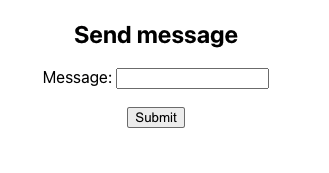

This project was bootstrapped with [Create React App](https://github.com/facebook/create-react-app).

## Short description

Application send message to backend.




## How to run only frontend app? - Docker Way

1. Enter project directory and set up environment variables

```bash
cd frontend/
cp .env.example .env
# edit .env
export $(cat .env | xargs)
```

Note that there is added `REACT_APP_` prefix.


2. Build Docker image and run it

```bash
make build
make run
# open http://localhost:8080/
```
