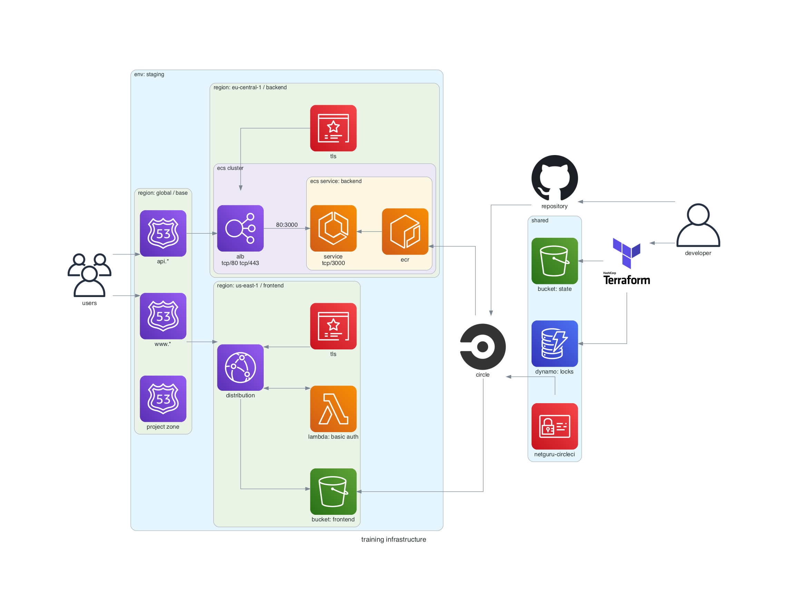

# Training Infrastructure

## Overview

All resources will be hosted in `cloudsandboxNN` account assigned for the user, where `NN` is a number.

### Shared Resources

- **DNS zone `cloudsandboxNN.devguru.co`.** Hosts Route53 records for backend, frontend, ACM domain verification etc.

### Frontend

- **S3 Bucket.** Hosts all static files. Updated by Circle CI deploys.
- **CloudFront Distribution (us-east-1 only).** CDN config, reading from frontend bucket. Provides TLS termination.
- **Basic Auth Lambda (us-central-1 only).** Invoked from CDN on each incoming request.
- **ACM.** TLS certificate service required by CDN.
  Hosted in us-east-1 region for compatibility with CloudFront.
- **DNS ALIAS Record `YOUR-training.cloudsandboxNN.devguru.co`.**
  Directs traffic to CDN.

### Backend

- **VPC.** A dedicated region-specific network to host EC2/ECS resources.
  (Omitted from diagram for simplicity.)
- **ECS Cluster.** Runs ECS services built from Dockerfiles.
  Provides central load balancing for backend services.
  Encapsulates a number of EC2 instances.
- **ECS Service `backend`.** Maps to single Dockerfile.
  Automatically scales number of running instances according to demand and configured autoscaling parameters (memory/CPU usage).
  Provides an integrated repository (ECR) to upload Docker images to.
  Refreshed by deploys triggered from Circle CI.
- **ACM.** TLS certificate service hosted in the same region as ECS cluster.
- **DNS ALIAS Record `api.YOUR-training.cloudsandboxNN.devguru.co`.**
  Directs traffic to application load balancer (ALB) in ECS cluster.

## Local Setup

    # prerequisites
    brew install tfenv pre-commit sops

    # development only
    brew install terraform-docs tflint coreutils

    # install git hooks
    pre-commit install

    # configure Terraform
    tfenv install   # reads .terraform-version
    tfenv use       # reads .terraform-version

## Deploy

    make clean staging apply

## Teardown

    make destroy
